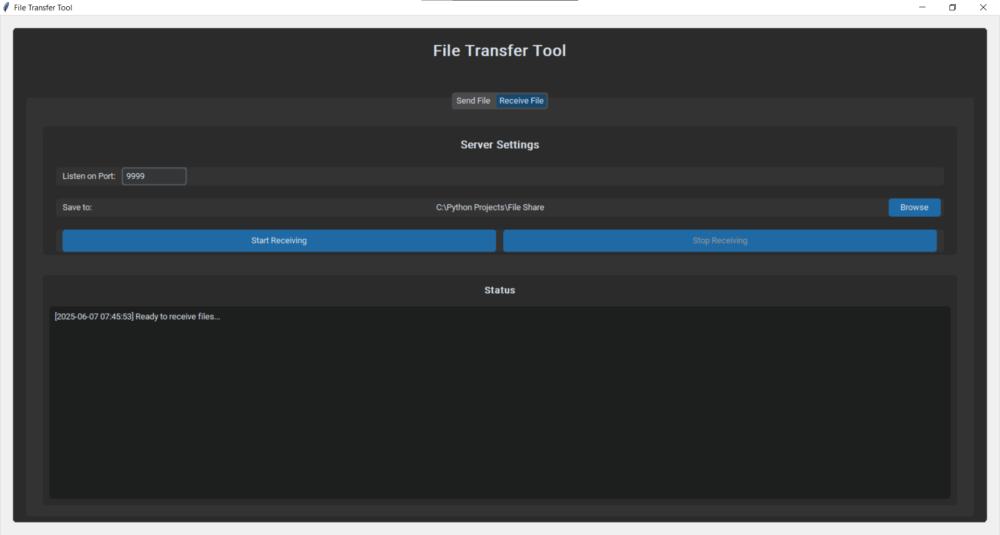

# 📁 Python File Share

A simple yet powerful **peer-to-peer file sharing app** built in Python! Works across devices on the same network.

Supports:
- ✅ One-to-one file transfers
- ✅ Auto host discovery
- ✅ Drag & Drop interface
- ✅ Multiple file transfers
- ✅ Transfer progress tracking
- ✅ File integrity check using SHA-256

---

## 🎯 Features

- 📤 **Sender Tab**  
  - Select files via file browser or drag & drop  
  - Enter host manually or use **Auto Discover**  
  - Custom destination filename  
  - Configurable port

- 📥 **Receiver Tab**  
  - Choose save location  
  - Start/Stop receiving with one click  
  - Set listening port

- 🔍 **Host Discovery**  
  - Scan and list available hosts on the network

- 📊 **Transfer Progress**  
  - Real-time file transfer status and logs

- 🔐 **Integrity Check**  
  - Uses SHA-256 to verify the file was transferred without corruption

- 📁 **Multi-file Support**  
  - Send multiple files in one go (automatically zipped)

---

## 📸 Screenshots

> 
> 

---

## 🚀 Getting Started

### ✅ Requirements
- Python 3.7+
- Cross-platform (Windows/Linux/macOS)
- No internet connection required (runs on local network)

### 🔧 Installation

1. Clone the repo:
   git clone https://github.com/your-username/python-file-share.git
   cd python-file-share

2. Install dependencies:
   pip install -r requirements.txt

3. Run the app:
   python main.py

📦 Packaging (Optional)
You can convert this into an .exe or standalone app using:
   pyinstaller --onefile app.py

🙌 Contributing
Contributions, bug reports, and feature requests are welcome!

1. Fork the repo

2. Create a new branch: git checkout -b feature-xyz

3. Commit your changes: git commit -m 'Add new feature'

4. Push and open a Pull Request

📢 License
MIT License – free to use, modify, and distribute.